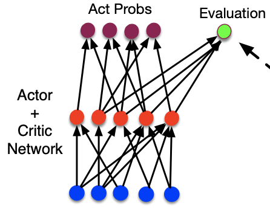
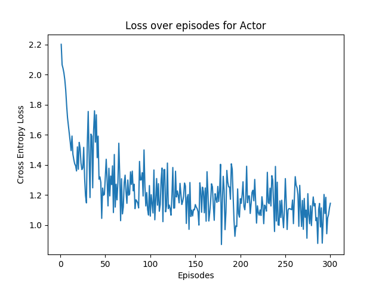
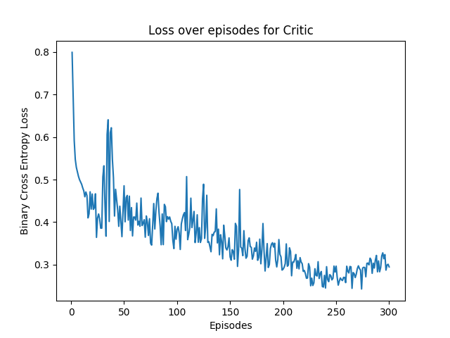
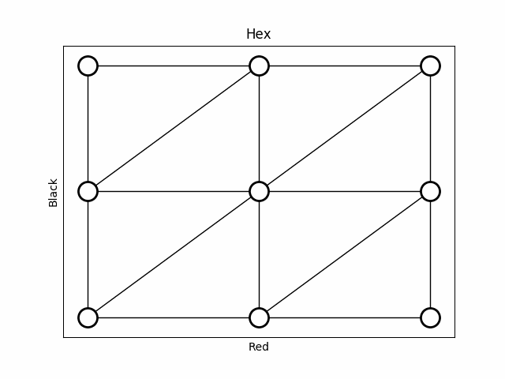

# Monte Carlo Search Tree for training shared Actor-Critic-Network 🏋️

In this project I reuse my general MCTS system that I built in an earlier project
to play the game of [Hex](https://en.wikipedia.org/wiki/Hex_(board_game)), which is a board
game with simple rules but a lot of possible board configurations. The exploration
of a these possible game states does not fit well for table-based RL and it is 
therefore necessary to use function approximators, such as neural nets, for 
value function and/or policy. In this task I do both in the same network.

## Model
For a small board of Hex, 3x3, a model with one hidden layer is enough for
it to learn the game pretty good. The input to the network will always be the 
state of the board as a 1D array, with the addition of which players turn it is.
This state is then forwarded through the network and produces two outputs. One output
is a probability distribution over actions on the board, aka the output for a policy
network, while the other output is a float telling the probability of winning 
in the given state, aka the output of a value function.

## Training
To train the network we need to save data produced by MCTS during the simulations. To
train the actor network we need to save a probability distribution from a state. This is
calculated by taking the total counts of visits to all child nodes of that state, and taking a
softmax over it so it sums up to 1. For the training the network as a critic we need (state, reward)
tuples. I therefore save states and their value calculated by the MCTS as training data.
I then sample a mini-batch of training data after each episode, and perform training on the network.
Here i use the Adam optimizer, Cross Entropy loss with soft targets for the distribution over actions
output and Binary Cross Entropy for the value/evaluation.   

Actor Loss |  Critic Loss | Example Game
:---:|:----:|:----:
  |   | 

## Files
* agent
    * actor.py - Actor / Critic
    * models.py - Actual neural net
* configs
    * config.yaml - Configuration file with different parameters used while training
* environment
    * action.py - Defining an action in the game
    * cell.py - Defining a cell on the board
    * game.py - Defining a general Game and Hex
    * state_manager.py - Taking care of updating the state of the game. MCTS should not have direct contact with the 
    actual game
* graphs
    * visualizer.py - A game visualizer used during training to save some games to gif
* simulator
    * game_simulator - Connects everything together and runs the whole algorithm
    * mcts - Code for Monte Carlo Search Tree
    * replay_buffer.py - Buffer for saving training data 
    * tree_node.py - Node in the MCTS
* main.py - main
* tournament.py - used to test pretrained models playing against each other
* utils.py - extra stuff